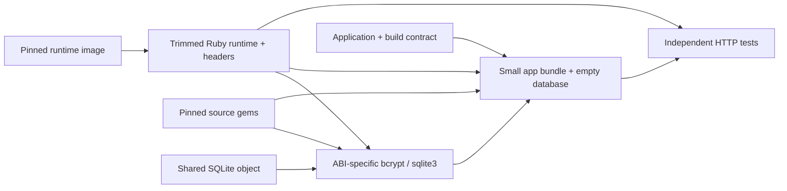

# Ruby version matrix

One shared Sinatra/Sequel RealWorld application runs on every stable Ruby
series from 1.9.3 onward, with one pinned latest patch per series. Releases
were checked against the [official Ruby release history](https://www.ruby-lang.org/en/downloads/releases/)
on 2026-10-03. The targets currently support Linux x86_64. Matrix tests carry the `manual`
tag so wildcard test runs do not start all versions; select a suite explicitly.
The BuildBuddy PR workflow explicitly selects the full matrix suite, retaining
its normal action and test caching across iterations.

```bash
# All 15 versions: smoke, hygiene, HTTP conformance and cross-version data parity.
bazel test //fixtures:ruby_matrix_suite

# Select a series while developing.
bazel test //fixtures:ruby_2_7_suite
bazel build //fixtures:ruby_4_0_rootfs

# Repeat tests while retaining cached runtime and application builds.
bazel test //fixtures:ruby_2_7_suite --nocache_test_results

# Run entirely locally; limits parallel build actions too.
bazel test --config=local --jobs=8 //fixtures:ruby_matrix_suite
```

Bazel downloads checksum-pinned runtime images and source gems. The configured
LLVM toolchain builds bcrypt and SQLite extensions for each interpreter ABI.
App assembly runs a contract check with that exact interpreter, then creates
an empty SQLite database schema. WEBrick uses a fixed localhost server name
and disables reverse lookups so executor-specific DNS/NSS settings cannot
load host libc plugins into a historical interpreter. Tests copy the seed into private writable
state; the runtime and app trees remain immutable. No Docker daemon, host
Ruby, system compiler, network access during build actions, or registry
publication is needed.

## Pins and dependencies

`matrix.json` owns interpreter versions, immutable Linux/amd64 image digests,
Ruby library ABIs and dependency-group selection. `dependencies.lock.json`
owns every gem version and SHA256, including transitive dependencies. The
builder verifies gem identity, Ruby requirements and dependency requirements
using the original gem metadata.

| Series | Pinned release | Ruby ABI | Dependency group |
| --- | --- | --- | --- |
| 1.9.3 | 1.9.3-p551 | 1.9.1 | legacy |
| 2.0 | 2.0.0-p648 | 2.0.0 | legacy |
| 2.1 | 2.1.10 | 2.1.0 | legacy |
| 2.2 | 2.2.10 | 2.2.0 | legacy |
| 2.3 | 2.3.8 | 2.3.0 | classic |
| 2.4 | 2.4.10 | 2.4.0 | classic |
| 2.5 | 2.5.9 | 2.5.0 | classic |
| 2.6 | 2.6.10 | 2.6.0 | classic |
| 2.7 | 2.7.8 | 2.7.0 | classic |
| 3.0 | 3.0.7 | 3.0.0 | classic_webrick |
| 3.1 | 3.1.7 | 3.1.0 | current |
| 3.2 | 3.2.11 | 3.2.0 | current |
| 3.3 | 3.3.12 | 3.3.0 | current |
| 3.4 | 3.4.11 | 3.4.0 | current |
| 4.0 | 4.0.7 | 4.0.0 | current |

The legacy group uses Sinatra 1.4, Sequel 4 and sqlite3 1.3; classic uses
Sinatra 2.2, Sequel 5 and sqlite3 1.4. Ruby 3.0 adds the extracted WEBrick gem.
Current uses sqlite3 2.8 and WEBrick. Dependencies shared between groups are
downloaded once per version. SQLite 3.50.4 is a separately pinned amalgamation
in `MODULE.bazel`, compiled once and linked into each SQLite Ruby extension.
The compatibility shim supports the older images' libc symbol interface.

These targets exercise the plain RealWorld API. Telemetry profiles retain
framework- and agent-specific targets in `fixtures/BUILD.bazel`.

## Identical RealWorld data

`//fixtures:ruby_matrix_parity_test` compares the full response data from the
same 76-request workload on all 15 versions. It drives the real HTTP server
against a private clone of the empty database seed, covering registration,
login, profile edits, follows, articles, filters, pagination, favorites,
comments, deletes, errors and Unicode usernames/titles/body text.

The test-only `parity/server.rb` fixes the clock and advances it by one second
per request; collision suffixes use a deterministic sequence. The comparator
checks exact JSON values and types, array order, HTTP status and content type.
Timestamps, JWTs, IDs, slugs and Unicode strings remain part of the comparison.
Only JSON object-key ordering is ignored. Each receipt must attest the exact
runtime pin, and missing or duplicate versions fail the gate.

Every app uses the same checksum-pinned pure Ruby `unicode_utils` normalizer
and data tables, so accented, decomposed and full-width titles produce the
same slugs across interpreter versions. Zero or negative page limits return
an empty page while retaining the total count.

```bash
bazel test //fixtures:ruby_matrix_parity_test
# Inspect one version's JSON receipt:
bazel build //fixtures:ruby_2_7_responses
```

Response receipts are small, independently cached Bazel outputs. Changing
the workload or its clock bootstrap rebuilds receipts and the comparison;
app bundles, native gems and runtimes remain cached. `--nocache_test_results`
reruns the comparator over those cached receipts; selecting the full matrix
suite also reruns its HTTP conformance tests. The parity bootstrap stays
outside the production app bundle and does not change its clock or randomness.

## Cache boundaries and rebuilds



| Change | Actions that rebuild |
| --- | --- |
| Application source or build contract | App bundle and affected tests |
| Pure Ruby gem pin | Bundles and tests selecting that dependency group |
| Native gem pin | That gem's extensions, dependent bundles and tests |
| Interpreter image pin | That runtime, its native extensions, bundle and tests |
| SQLite source or compatibility shim | Common SQLite object, SQLite links, bundles and tests |
| Parity workload or test clock | Response receipts and comparison; app builds remain cached |
| HTTP scenario | That scenario's tests; compiled apps remain cached |
| No changes | Bazel reuses build actions and test results |

A source-edit probe on Ruby 1.9.3 and 4.0 executed only two `RubyAppBundle`
actions, with no runtime extraction or native compilation. An unchanged build
executed no build actions. The matrix includes 255 per-version conformance tests and one cross-version
data parity test, with separate comparator and launcher/extractor unit tests.

Measured file content is 7–8 MiB per app and 33–95 MiB per runtime. All 15
app/runtime pairs total approximately 957 MiB before remote CAS deduplication;
filesystem block allocation is slightly larger. Compiler/toolchain outputs
and the download repository cache are additional one-time storage.

Runtime output contains the interpreter, headers, standard libraries and the
ELF shared-library dependency closure. Compiler binaries, static archives,
package caches and documentation are removed. App outputs contain only source,
selected gem libraries, two native extensions, gem specifications and the seed.
The runtime is a separate input/runfile, so app edits do not copy it into a new
output. Source images still occupy the Bazel repository cache on first fetch;
CAS deduplicates shared files and layers across actions. Avoid `bazel clean`
for ordinary source edits or test retries.

`//fixtures:ruby_<series>_runtime`, `_bcrypt`, `_sqlite3`, `_rootfs`, `_service`
and `_suite` expose each boundary explicitly (dots become underscores).
`bazel/ruby_matrix.bzl` declares downloads; `fixtures/ruby_build.bzl` declares
build actions; `fixtures/ruby_matrix.bzl` declares services and test suites.
Adding a series requires its reviewed runtime pin, ABI and dependency group in
`matrix.json`, plus its repository import in `MODULE.bazel`.
